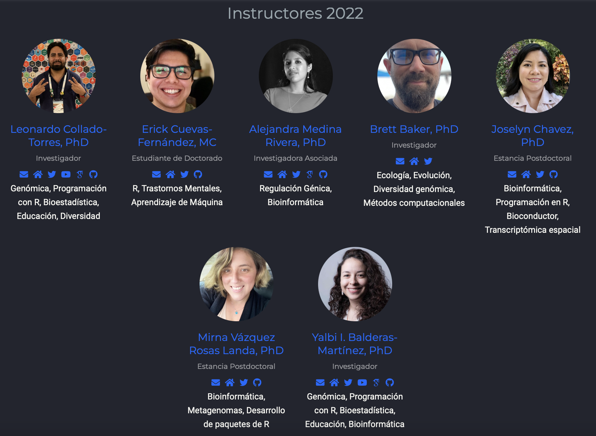

class: center

# ¡Bienvenidxs a la CDSB!
<br><br>
```{r,echo=FALSE,out.width='90%',fig.align='center'}
knitr::include_graphics("css/logo.png")
```
<br><br>
Twitter: [@CDSBMexico](https://twitter.com/CDSBMexico)

Facebook: [@CDSBMexico](https://www.facebook.com/CDSBMexico)

Página web: https://comunidadbioinfo.github.io

---
class: center

# ¿Quiénes somos?

La comunidad de desarrolladores de Software en Bioinformática, nace de la inquietud por incentivar la participación y colaboración de gente especializada en Bioinformática y Genómica, para contribuir o emprender en el desarrollo de software libre a nivel internacional.

```{r,echo=FALSE,out.width='56%',fig.align='center'}
knitr::include_graphics("img/somos.png")
```

---
class: center

# Nuestros instructores

```{r,echo=FALSE,out.width='56%',fig.align='center'}

```

---
# Nuestros ayudantes

<br><br><br>
```{r,echo=FALSE,out.width='45%',fig.align='center'}
knitr::include_graphics("img/ayudantes.png")
```

---
# Materiales

.center[https://github.com/ComunidadBioInfo/cdsb2022]

```{r,echo=FALSE,out.height='100%'}
knitr::include_url("https://comunidadbioinfo.github.io/cdsb2022/")
```

---
# Slack

.pull-left[<br>
```{r,echo=FALSE,out.width='110%'}

```
]

.pull-right[
```{r,echo=FALSE,out.width='50%',fig.align='center'}
knitr::include_graphics("img/slack.png")
```

Canales importantes:
- Bienvenida
- General
- cdsb2022
]

---
# Videos del taller

```{r,echo=FALSE,out.width='90%',fig.align='center'}
knitr::include_graphics("img/youtube.png")
```
.center[https://www.youtube.com/channel/UCHCdYfAXVzJIUkMoMSGiZMw]

---
# Código de Conducta

.center[https://comunidadbioinfo.github.io/es/codigo-de-conducta/]

```{r,echo=FALSE,out.height='100%'}
knitr::include_url("https://comunidadbioinfo.github.io/es/codigo-de-conducta/")
```
---
# Patrocinadores

.pull-left[<br><br><br><br><br>
<a href="https://www.r-consortium.org/"></a>
]
.pull-right[
<a href="https://comunidadbioinfo.github.io/es/post/cs_and_s_event_fund_award/#.YJH-wbVKj8A"></a>
]

---
.pull-left[<br><br><br><br><br><br><br>
# Disfruten el taller!
]

.pull-right[
```{r,echo=FALSE,out.width='90%',fig.align='center'}
knitr::include_graphics("img/xolo.png")
```
]
